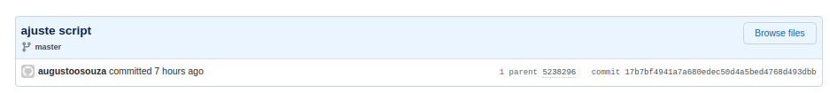
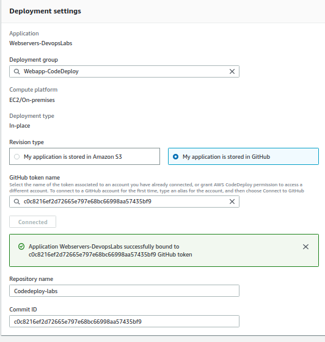

# AWS CodeDeploy Exemplo - Devops Labs
 
Codigo Exemplo para deploy de servidor WEB usando CodeDeploy  usando github.

## Como utilizar?

1. Fazer um fork do projeto para seu repositorio Github.
2. Acessar o ultimo commit e copiar o id. Ele servirá como token no CodeDeploy

3. Autenticar com sua conta Github no CodeDeploy

**Augusto Souza** 

**Devops Engineer**